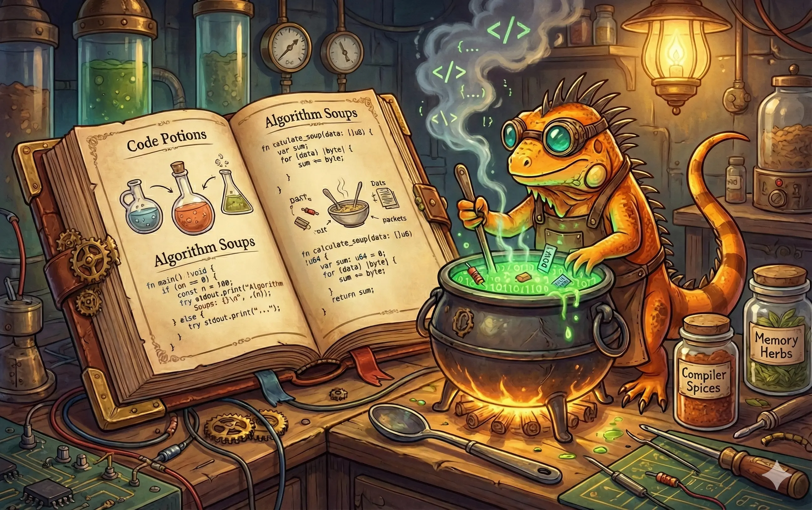

# Zig Cookbook

[Zig Cookbook](https://github.com/zigcc/zig-cookbook) 是一系列简单的 Zig 示例程序合集，展示了完成常见编程任务的良好实践。

> - 主分支跟踪 Zig 0.16.x，并通过 GitHub Actions 在 Linux 和 macOS 上进行测试。
> - 更早版本的 Zig 支持可以在[其他分支](https://github.com/zigcc/zig-cookbook/branches)中找到。

# 如何使用

[网站](https://cookbook.ziglang.cc/)由 [zine-ssg](https://zine-ssg.io) 生成，这是一个为 Zig 打造的静态网站生成器。`zine` 会在 `http://localhost:1990` 启动一个本地服务器用于预览。

每个示例都附带一个以对应序号命名的可运行代码。可以使用 `zig build run-{章节号}-{序号}` 来执行单个示例，或使用 `zig build run-all` 来执行全部示例。

> ## 注意
>
> 部分示例可能依赖系统库
>
> - 使用 `make install-deps` 安装客户端库
> - 使用 `docker-compose up -d` 启动所需的数据库

# 贡献

本 Cookbook 仍在持续完善中，欢迎社区贡献。如果你有想分享的示例，请提交 [Pull Request](https://github.com/zigcc/zig-cookbook/pulls)。

## 本地化

在对应语言文件夹中创建相应的示例，完成翻译后提交 [Pull Request](https://github.com/zigcc/zig-cookbook/pulls)。

# 致谢

Zig Cookbook 受到以下类似项目的启发，感谢它们出色的工作。

- [Rust Cookbook](https://github.com/rust-lang-nursery/rust-cookbook)
- [zine-ssg](https://zine-ssg.io)，感谢 [Loris Cro](https://github.com/kristoff-it) 为 Zig 创建了这个优秀的静态网站生成器。

# Star 趋势

# 许可证

Markdown 文件采用 [CC BY-NC-ND 4.0 DEED](https://creativecommons.org/licenses/by-nc-nd/4.0/) 许可，Zig 文件采用 MIT 许可。
