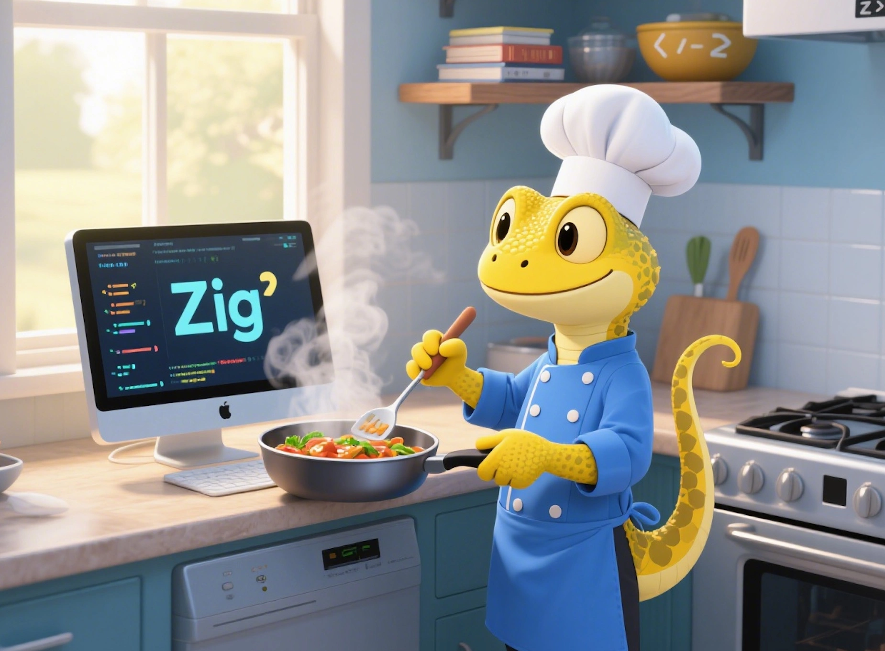

# Zig Cookbook

[Zig cookbook](https://github.com/zigcc/zig-cookbook) is a collection of simple Zig programs that demonstrate good practices to accomplish common programming tasks.

> - Main branch tracks Zig 0.15.x, and is tested on Linux and macOS via GitHub actions.
> - Earlier Zig support could be found in [other branches](https://github.com/zigcc/zig-cookbook/branches).

# How to use

[The website](https://cookbook.ziglang.cc/) is generated by [zine-ssg](https://zine-ssg.io), a static site generator for Zig. `zine` will start a server at `http://localhost:1990` for preview.

Each recipe is accompanied by an illustrative example named after its corresponding sequence number. These examples can be executed using the command `zig build run-{chapter-num}-{sequence-num}`, or `zig build run-all` to execute all.

> ## Note
>
> Some recipes may depend on system libraries
>
> - Use `make install-deps` to install client libraries, and
> - `docker-compose up -d` to start required databases.

# Contributing

This cookbook is a work in progress, and we welcome contributions from the community. If you have a favorite recipe that you'd like to share, please submit a [pull request](https://github.com/zigcc/zig-cookbook/pulls).

## Localization

Create corresponding recipe in the language folder, localize it, and submit a [pull request](https://github.com/zigcc/zig-cookbook/pulls).

# Acknowledgment

Zig Cookbook was inspired by several other similar projects. We would like to thank the following projects, thanks for their awesome work.

- [Rust Cookbook](https://github.com/rust-lang-nursery/rust-cookbook)
- [zine-ssg](https://zine-ssg.io), thanks to [Loris Cro](https://github.com/kristoff-it) for creating this awesome static site generator for Zig.

# Star History

# License

The markdown files are licensed under [CC BY-NC-ND 4.0 DEED](https://creativecommons.org/licenses/by-nc-nd/4.0/), and zig files are under MIT.
